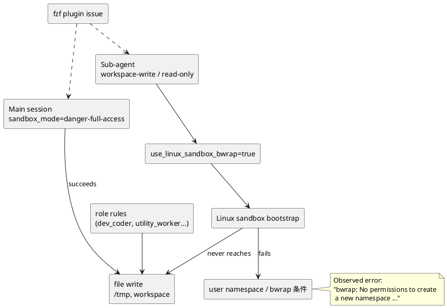

# Sub-Agent bwrap Sandbox Failure Report

更新日: 2026-03-12
対象: このサンドボックス環境上で発生している `dev_coder` / `utility_worker` / `spark_worker` などの sub-agent 実行失敗

## 結論

今回の sub-agent 障害は、**直前に行った `fzf` plugin 除去修正とは直接関係していない** と判断する。

理由は単純で、両者の失敗層が異なるためである。

- `fzf` 問題:
  - interactive `zsh` startup
  - `/usr/share/doc/fzf/examples/key-bindings.zsh` 欠落
  - shell plugin 初期化の失敗
- 今回の sub-agent 問題:
  - sub-agent 起動直後
  - `bwrap: No permissions to create a new namespace ...`
  - Linux sandbox bootstrap の失敗

したがって、時系列は近いが、因果関係は薄い。  
今回の問題の本質は **sub-agent 共通の sandbox 起動失敗** であり、`dev_coder` の権限問題ではない。

## 1. 何が起きているか

共有された再現試験では、以下の3種類がすべて同じ層で失敗している。

- `dev_coder`:
  - `/tmp/devcoder-probe.txt` を作る前に失敗
- `utility_worker`:
  - `/tmp/utility-probe.txt` を作る前に失敗
- `spark_worker`:
  - read-only なのに `pwd` や `/tmp` 確認すらできず失敗

この時点で、`dev_coder` 固有でも、write 権限固有でもなく、**sub-agent 起動時の共通基盤** を疑うべき状態になっている。

## 2. 確認できた事実

### 2.1 main session は通常の書き込みができる

- メインセッションでは `/tmp` にファイルを作成・削除できる
- よって Linux の通常ファイル権限や `/tmp` の mount 権限が主因ではない

### 2.2 sub-agent 側は role をまたいで失敗している

- `dev_coder` は `workspace-write`
- `utility_worker` も `workspace-write`
- `spark_worker` は `read-only`

それにもかかわらず全部失敗しているため、原因は role の責務や write policy ではなく、**sandbox bootstrap の前段** である。

### 2.3 config 上で bwrap 系 sandbox が有効

`/home/node/.codex/config.toml` では、以下が確認できる。

- `sandbox_mode = "danger-full-access"` は main session 用
- `features.use_linux_sandbox_bwrap = true`

また `/home/node/.codex/agents/*.toml` では、sub-agent ごとに `sandbox_mode = "workspace-write"` または `sandbox_mode = "read-only"` が設定されている。

つまり、main session は full access で動き、**sub-agent だけが Linux sandbox を張る経路** に入っている。

### 2.4 kernel / runtime の条件が怪しい

このコンテナ内では、少なくとも次が観測できる。

- カーネル: `Linux 6.17.8-orbstack-00308-g8f9c941121b1`
- `/proc/sys/user/max_user_namespaces` は存在する
- `/proc/sys/kernel/unprivileged_userns_clone` は存在しない
- `/proc/self/status` では `Seccomp: 2`

これだけで断定はしないが、`bwrap: No permissions to create a new namespace` というエラーと非常に整合的である。

## 3. 原因の整理

### 解釈

- file write 前に sandbox 起動で死んでいる
- だから「このディレクトリに書けるか」は論点ではない
- `dev_coder` の `.codex` 制約も今回の主因ではない
- 問題は **sub-agent launcher が期待する Linux sandbox 条件がこの環境で満たされていないこと**

## 4. `fzf` 修正との関係

### 結論

**直接の関係はない**

### 理由

- `fzf` 修正は `[Dockerfile](/srv/mount/box/Dockerfile)` と `[sandbox_term_env.test.sh](/srv/mount/box/tests/sandbox_term_env.test.sh)` の変更のみ
- それは interactive `zsh` startup の plugin 読み込みを止めた修正
- 今回の sub-agent 問題は `/home/node/.codex/config.toml` および `/home/node/.codex/agents/*.toml` が使う sandbox 経路で起きている
- エラー文字列も `zsh` ではなく `bwrap` / namespace 作成失敗である

### ありうる「間接的な関係」

ほぼ無いが、強いて言えば「同じコンテナ上で別の不具合が連続して見つかった」という運用上の近接だけである。  
技術的には別レイヤーの問題として扱うべき。

## 5. 最も合理的な仮説

最有力仮説は次の通り。

1. main session は `danger-full-access` のため bwrap 経路を使わず普通に動く
2. sub-agent は `workspace-write` / `read-only` sandbox で起動される
3. その sandbox 実装が user namespace / bwrap 相当の機構を必要とする
4. しかしこの OrbStack 上のコンテナ環境では、その bootstrap 条件が満たされず、sub-agent 全体が起動前に落ちる

## 6. 現時点の判断

以下の判断は、現時点でかなり強い。

- `dev_coder` 固有の不具合ではない
- write 系 role 固有の不具合でもない
- repo 内の対象ディレクトリ権限が主因ではない
- main session の file permission とは別問題である
- sub-agent 共通の Linux sandbox 起動経路が壊れている

## 7. 実務上の示唆

優先順位は次の順がよい。

1. `role` ではなく `sandbox 起動設定` を疑う
2. `.codex` 書き込み可否より前に、sub-agent bootstrap を直す
3. 最小切り分けとして、sub-agent 1種類だけ bwrap 非依存の経路で起動できるか試す

## 8. 回避策候補

- A: `use_linux_sandbox_bwrap` を無効化して再現差を見る
  - もっとも直接的な切り分け
- B: sub-agent の sandbox_mode を一時的に main に近い経路へ寄せて比較する
  - 危険度は上がるが因果の確認には有効
- C: host / container 側で user namespace を許容する条件へ寄せる
  - 根治寄りだが、環境依存で重い

## 9. 今回の意思決定材料

コンテキスト継続の観点では、次の判断が妥当。

- `fzf` 修正は完了済みの別件として扱ってよい
- sub-agent 問題は新しい issue / discussion として切り出してよい
- したがって、**コンテキストを分ける判断には十分な根拠がある**

## 10. 次にやるべきこと

- `use_linux_sandbox_bwrap = true` を中心に、sandbox 経路の切り分け計画を立てる
- 変更候補を比較した discussion を作る
- その後、必要なら要件定義書 / 設計書 / 実装計画書へ落とす
