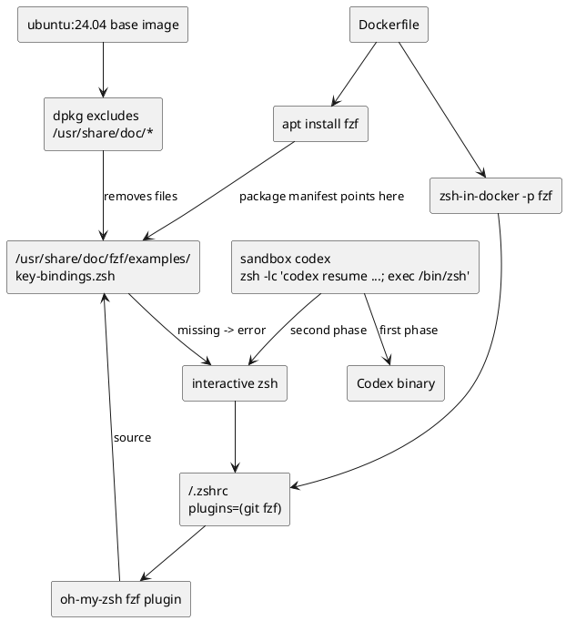
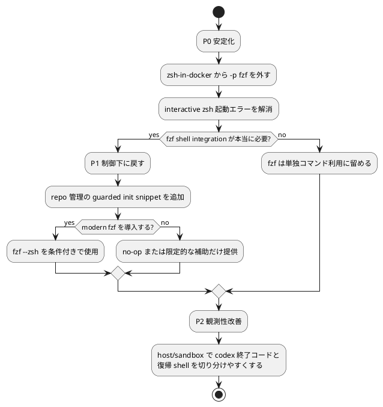

# fzf / zsh 初期化不整合の分析シート

更新日: 2026-03-11
目的: `Codex CLI` 停止時に見えた `fzf_setup_using_debian:source:40: no such file or directory: /usr/share/doc/fzf/examples/key-bindings.zsh` について、根本原因、対策案、ベストプラクティス候補を議論するためのシートをまとめる。

## 1. エグゼクティブサマリー

- 根本原因は、`Codex` 本体ではなく、`Ubuntu 24.04` ベース image の `doc exclusion` と `oh-my-zsh` の `fzf` plugin の不整合である。
- 現在の構成では、`Dockerfile` が `fzf` を apt install しつつ `zsh-in-docker -p fzf` で shell plugin を有効化する一方、ベース image は `/usr/share/doc/*` を削るため、plugin が参照する `key-bindings.zsh` 実体が存在しない。
- このエラーは実在する環境バグだが、`Codex CLI` 停止の単独原因とは断定しにくい。現セッションでも同じエラーを含む環境で `codex resume` は継続動作している。
- ベストプラクティスは、`oh-my-zsh` の distro 依存 `fzf` plugin に依存しないこと。つまり、`-p fzf` をやめて shell 初期化を repo 側で明示管理し、必要なら guarded な初期化だけを自前で持つ方が堅牢である。

## 2. 確定した事実

- `Dockerfile` は `fzf` と `zsh` を install している。
- `Dockerfile` は `zsh-in-docker` を `-p git -p fzf` 付きで実行している。
- 生成された `~/.zshrc` は `plugins=(git fzf)` である。
- 実コンテナの `/etc/dpkg/dpkg.cfg.d/excludes` には `path-exclude=/usr/share/doc/*` がある。
- 実コンテナでは `dpkg -L fzf` に `key-bindings.zsh` が出る一方、`dpkg -V fzf` と `ls` では実体欠落が確認できる。
- 素の `ubuntu:24.04` に `fzf` だけを install しても、同じく package manifest 上は存在し、実体は欠落する。つまり、この欠落はベース image 由来である。
- `sandbox codex` は `zsh -lc 'codex resume ...; exec /bin/zsh'` で起動する。
- `zsh -lc` では `fzf` エラーは出ず、interactive な `zsh -ic` や `exec /bin/zsh` でエラーが表面化する。
- コンテナ起動ログ自体にも、すでに同じ `fzf` エラーが出ている。

## 3. 因果関係の整理

### 解釈

- 失敗点は `Codex` バイナリではなく、interactive `zsh` の startup である。
- よって、直すべき対象は shell 初期化設計であり、`Codex` 本体ではない。
- さらに、`/usr/share/doc` 依存の plugin は base image のポリシー変更に弱い。

## 4. 問題の本質

今回の不具合の本質は、次の3点にある。

1. shell 初期化が repo 管理下にない  
   `zsh-in-docker -p fzf` に依存しており、どのパスを読むかの責務が外部実装にある。

2. runtime の必須機能ではないものが shell 起動の必須パスに入っている  
   `fzf` の key bindings は補助機能だが、現在は shell startup の失敗点になっている。

3. distro 固有の doc path に依存している  
   `/usr/share/doc` は「実行時に必ずある」とは限らず、ミニマル image では特に不安定である。

## 5. 対策案の比較

| 案 | 内容 | 強さ | 弱さ | 向いている場面 | 判定 |
|---|---|---|---|---|---|
| A | `zsh-in-docker` の `-p fzf` をやめる | 最小変更で根本原因を止める。doc path 依存を除去できる | `fzf` key bindings/completion を失う | まず環境を安定化したいとき | 強く推奨 |
| B | `DISABLE_FZF_KEY_BINDINGS=true` を入れる | エラー表示を最小変更で止めやすい | plugin 依存は残り、completion 側も黙って壊れうる | 応急処置 | 次善の暫定策 |
| C | `/usr/share/doc/fzf/examples/*` を残すよう image を調整する | 現 plugin をそのまま動かせる | base image と package layout に強く依存し、image サイズも増える | 既存 plugin を絶対維持したいとき | 非推奨 |
| D | `fzf` を upstream 版へ更新し `fzf --zsh` を guarded に使う | 将来性が高く、doc path に依存しない | package source が増え、バージョン管理が重くなる | shell UX を重視し、依存追加を許容できるとき | 条件付き推奨 |
| E | repo 管理の guarded init snippet を自前で持つ | 初期化責務を repo 側で制御できる。存在確認も明示できる | 少量だが shell 初期化コードの保守責務を持つ | 中長期で堅牢にしたいとき | 最有力 |
| F | `host/sandbox` で `codex` の終了コード表示や `exec /bin/zsh` 条件分岐を追加する | 停止原因の観測性を上げる | root cause は直らない | 再発時の切り分け改善 | 補助策として推奨 |

## 6. 最有力のベストプラクティス案

### 推奨方針

`oh-my-zsh` の `fzf` plugin 依存をやめ、repo 側で管理する guarded な shell 初期化へ切り替える。

### 実質的な実装イメージ

- `Dockerfile` の `zsh-in-docker` から `-p fzf` を外す
- まずは `fzf` 補助機能を無効化した安定状態に戻す
- そのうえで、必要なら repo 管理の小さな snippet で次だけを行う
  - `fzf` コマンド存在確認
  - `fzf --zsh` が使える場合だけ有効化
  - それ以外は何もしない

### この案が最有力な理由

- shell 起動の安定性を最優先できる
- `Ubuntu` や `oh-my-zsh` の内部実装に依存しない
- `fzf` 補助機能の失敗を shell 全体から切り離せる
- 将来 `fzf` の導入方法を変えても repo 側で吸収できる
- 「補助機能は no-op でよいが、shell 起動は絶対に壊さない」という原則に合う

## 7. 次点案

### 次点案

`fzf` を upstream 版へ上げ、`fzf --zsh` を guarded に使う。

### 評価

- shell UX を維持したい場合は魅力的
- ただし、今の repo は sandbox 提供ツールであり、まずは安定性が優先
- `fzf` の供給源が apt から外れるため、メンテナンスと監査対象が増える

## 8. 採用しない案の理由

- doc path を戻す案は、`/usr/share/doc` を runtime 依存にしてしまい、ミニマル image の流儀とぶつかる
- `DISABLE_FZF_KEY_BINDINGS=true` だけの案は、症状を抑えるだけで責務の所在が曖昧なまま残る
- `host/sandbox` 側だけ直す案は、コンテナ起動ログや `sandbox shell` の不具合を解決できない

## 9. 推奨する実施順序

### フェーズ別推奨

- P0: `-p fzf` を外して startup error を止める
- P1: `fzf` 連携が必要なら repo 管理 snippet で guarded に戻す
- P2: `host/sandbox` の観測性を上げ、今後の切り分けを容易にする

## 10. 受け入れ基準のたたき台

- コンテナ起動ログに `fzf_setup_using_debian` エラーが出ない
- `docker exec <container> /bin/zsh -ic 'exit'` が stderr 汚染なしで終わる
- `sandbox shell` で `zsh` 起動時のエラーが出ない
- `sandbox codex` の開始と終了後に同じ `fzf` エラーが出ない
- `fzf` 補助機能を戻す場合は、利用不能時に no-op で落ちない

## 11. 議論ポイント

- この repo は `fzf` の shell integration を「標準機能」とみなすか、「あると便利な補助」とみなすか
- 依存を増やしてでも `fzf --zsh` ベースの UX を取りにいくか
- sandbox 提供ツールとしての優先順位を、UX より起動安定性に置くか

## 12. 現時点の提案

現時点では、次の提案が最も妥当である。

- まず `-p fzf` をやめる
- shell startup を repo 管理下に戻す
- `fzf` 連携は guarded / opt-in にする
- `host/sandbox` のログと終了コード表示を少し改善して、今後「本当に Codex が落ちたのか」「復帰 shell が騒いでいるだけか」を見分けやすくする

この方針なら、根本原因を潰しつつ、将来的に `fzf` 体験を戻す余地も残せる。
