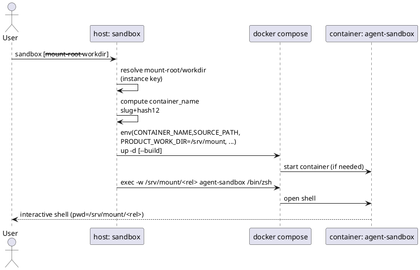

# FEAT-005 動的マウント起動（任意ディレクトリをSandboxとして起動） — 設計（HOW）

## 目的・制約（要件から転記・圧縮） (必須)
- 目的:
  - 任意のディレクトリ（git worktree含む）を対象に、同一の `agent-sandbox` リポジトリから複数コンテナを並行起動できるようにする。
  - Docker-on-Docker（DoD）運用を壊さない（ホストパス変換が成立する）。
- MUST（要件の要約）:
  - `sandbox` コマンド（ホスト側）で起動できる。
  - `mount-root` と `workdir` を分離し、引数なし時は git を解析して `mount-root` を自動推定する（ガードあり）。
  - 同一性キーは `(abs_mount_root, abs_workdir)`（realpath）で、同一キーは同一コンテナへ再利用。
  - コンテナ内マウント先は `/srv/mount` 固定（動的モード）。
  - `.agent-home` は共有（分離しない）。
  - インスタンスごとの compose/env 生成物を増やさない（1 compose を使い回し、起動時に値注入）。
- MUST NOT:
  - `--name` 等の手動コンテナ名指定は追加しない。
  - “広すぎる” 自動推定を無理に包含しない（エラーで拒否）。
  - 既存のセキュリティ特性を緩めない。
- 非交渉制約:
  - DoD の `HOST_PRODUCT_PATH` / `PRODUCT_WORK_DIR` の意味を壊さない（`@.spec-dock/current/requirement.md` TERM-005/006）。

---

## 既存実装/規約の調査結果（As-Is / 95%理解） (必須)
### 参照した実装（根拠）
- `.spec-dock/current/requirement.md`: As-Is の根拠（行番号つき）を集約しているため、設計の前提として参照する。
- `docker-compose.yml`:
  - `name:` / `container_name:` / `working_dir:` と、DoD環境変数・volume mount の実体（`docker-compose.yml:1`, `:11-13`, `:31-37`, `:48`, `:54-55`）。
- `scripts/generate-env.sh`:
  - `.agent-home` ディレクトリ作成（`scripts/generate-env.sh:21-36`）
  - `PRODUCT_WORK_DIR=/srv/$product_name` の生成（`scripts/generate-env.sh:155-161`）
  - コンテナ名生成（最大63文字制限）（`scripts/generate-env.sh:71-103`）
- `Makefile`:
  - `make start` が `.env` の `CONTAINER_NAME` / `PRODUCT_WORK_DIR` を使って起動/接続している（`Makefile:86-113`）。
- `scripts/docker-entrypoint.sh`:
  - docker.sock の権限調整と `docker version` 疎通（`scripts/docker-entrypoint.sh:5-25`, `:55-60`）。
- 外部依存（DoDパス変換）:
  - `/Users/iwasawayuuta/workspace/product/taikyohiyou_project/scripts/git/detect_git_env.sh` が `HOST_PRODUCT_PATH` と `PRODUCT_WORK_DIR` を前提に “コンテナ内パス→ホストパス” 変換をしている（同 `:15-25`）。

### 観測した現状（設計上の意味）
- 現状は `SOURCE_PATH` と `PRODUCT_WORK_DIR` が “マウントの対応関係” と “初期作業ディレクトリ” の両方に使われている。
- DoD の整合（`HOST_PRODUCT_PATH` / `PRODUCT_WORK_DIR`）を守るため、**`PRODUCT_WORK_DIR` は「変換の基準パス（コンテナ側）」として固定し、初期 `workdir` は別経路（exec の `-w`）で制御**するのが安全。
- `.agent-home` は host bind mount 前提で、ディレクトリが無い場合は root ownership になりやすく、node ユーザーが書けずにハマる可能性がある（= 起動スクリプト側で事前作成が必要）。

### 採用するパターン
- ホスト側は Bash スクリプトで完結（既存と整合）。
- コンテナ同一性は “決定的” にし、コンテナ名で再利用判定（`docker inspect`）ができるようにする。

### 採用しない/変更しない（理由）
- Devcontainer は今回切り捨てる（要件 OUT OF SCOPE）。
  - `.devcontainer/*` を本機能の変更対象に含めない。
  - dynamic 起動（`sandbox`）で Devcontainer を使うことはサポートしない。
- `.agent-home` の分離は行わない（要件 OUT OF SCOPE）。

---

## 主要フロー（テキスト：AC単位で短く） (任意)
- Flow for AC-001（引数なし起動 / git worktree 自動推定）:
  1) `workdir=呼び出し元PWD` を決定（実在確認→絶対パス化）
  2) `git` を実行して worktree 一覧を取得し、全 worktree を包含する `mount-root` を推定
  3) “広すぎる” ならエラーで終了（明示指定を促す）
  4) `instance key` → `container_name` を決定
  5) `docker compose up -d`（必要なら build）→ `docker compose exec -w <container_workdir>`
- Flow for AC-002（明示指定起動）:
  1) `--mount-root` と `--workdir` を検証（実在/絶対パス化/包含関係）
  2) `instance key` → `container_name` → 起動/接続

---

## インターフェース契約（ここで固定） (必須)

### CLI（ホスト側）
- IF-CLI-001: `sandbox`
  - 目的: 動的マウント起動（本機能）
  - Usage（案）:
    - `sandbox`（= `sandbox shell`）
    - `sandbox help`（ヘルプ表示）
    - `sandbox shell`（起動+接続）
    - `sandbox up`（起動のみ）
    - `sandbox build`（ビルドのみ）
    - `sandbox stop`（停止のみ）
    - `sandbox down`（停止+削除）
    - `sandbox status`（状態表示）
    - `sandbox name`（コンテナ名の表示）
    - `sandbox -h` / `sandbox --help`（`sandbox help` と同義）
    - `sandbox <subcommand> -h` / `sandbox <subcommand> --help`（サブコマンド固有ヘルプ）
  - 引数（共通）:
    - すべてのサブコマンドは `--mount-root <path>` / `--workdir <path>` を受け取る
    - `mount-root/workdir` の決定ルールは「具体設計 2)」に従う
      - 引数なし: `workdir=呼び出し元PWD`、`mount-root` は git 解析で自動推定（非gitなら `mount-root=呼び出し元PWD`）
      - `--mount-root <path> --workdir <path>`: 明示指定（両方）
      - `--mount-root <path>` のみ: `workdir=mount-root` に補完
      - `--workdir <path>` のみ: `mount-root` を git 解析で自動推定に補完（非gitなら `mount-root=workdir`）
    - 例外（ヘルプ）:
      - `help` / `-h` / `--help` は **パス決定・検証より先に処理**し、無効なパス指定が混ざっていてもヘルプを表示して exit 0 で終了する。
        - `-h/--help` は **引数のどこに現れても最優先**（例: `sandbox help --workdir /nope` / `sandbox shell --workdir /nope --help`）。
  - 振る舞い（サブコマンド別）:
    - `sandbox shell` / `sandbox`:
      - 対象コンテナが起動していなければ起動する（必要なら build）
      - `docker compose exec -w "$container_workdir"` で接続する
    - `sandbox up`:
      - 対象コンテナを起動する（コンテナが無ければ build を伴う）
      - シェル接続は行わない
    - `sandbox build`:
      - `docker compose build` 相当を行う
      - 起動/接続は行わない
    - `sandbox stop`:
      - 対象コンテナが存在する場合は停止する
      - 存在しない場合は「対応するコンテナがありません」等を表示し、成功終了（exit 0）
    - `sandbox down`:
      - 対象コンテナが存在する場合は `docker compose down` 相当で停止+削除する
      - 存在しない場合は「対応するコンテナがありません」等を表示し、成功終了（exit 0）
    - `sandbox status`:
      - 対象コンテナの存在/状態/ID を表示する（副作用なし）
      - 対象コンテナが存在しない場合は「対応するコンテナがありません」等を表示し、成功終了（exit 0）
    - `sandbox name`:
      - 対象インスタンスの `container_name` を合成して標準出力へ 1 行だけ出力し、exit 0
      - Docker の状態（存在/稼働/停止）は問わない（Docker を見に行かない）
    - `sandbox help` / `-h` / `--help`:
      - ヘルプ（Usage/サブコマンド一覧/共通引数/例）を表示し、exit 0
  - 標準出力（観測点）:
    - `sandbox name`: `container_name` のみ（1行）
    - `sandbox status`: 以下のキーを含む複数行（少なくとも各1回ずつ）
      - `container_name`
      - `status`（存在しない場合は `not-found`）
      - `container_id`（存在しない場合は `-`）
      - `mount_root`（ホスト絶対パス / realpath）
      - `workdir`（ホスト絶対パス / realpath）
      - 形式: `key: value`（1行1キー）
      - 追加情報（任意）: 対象が無い場合は `message: 対応するコンテナがありません` 等を追加してよい
    - `sandbox name` / `sandbox status` / `sandbox help` は stdout が契約のため、デバッグログ等は stderr に出して stdout を汚さない
    - それ以外: 選ばれた `mount-root` / `workdir` / `container_name`（必要に応じて `container_workdir`）
  - 終了コード:
    - 0: 成功（`stop`/`down` は “対象が無い” 場合も成功）
    - 非0: 入力不正、git解析失敗、ガード違反、docker失敗 など

### Compose へ注入する値（動的モード）
- IF-ENV-001: 変数注入（docker compose 実行時）
  - `TZ=<timezone>`（未設定なら検出して注入する）
    - ルール:
      - 既に `TZ` が設定されている場合（ユーザーの `.env` または起動時の環境変数）はそれを尊重する（上書きしない）
        - `.env` の尊重: `SANDBOX_ROOT/.env` に `TZ=` が **非空で** 定義されている場合、起動スクリプトは `TZ` を注入しない（compose の `.env` 読み込みに任せる）
        - 環境変数の尊重: `TZ` が起動スクリプトの環境変数として **非空で** 設定されている場合、起動スクリプトは `TZ` を注入しない
      - ただし、`.env` や環境変数で `TZ` が **空文字**（例: `TZ=`）の場合は “未設定” と同様に扱い、ホストの timezone を検出して注入する（空のままにしない）。
      - 未設定の場合はホストの timezone を検出して注入する（失敗時は `Asia/Tokyo`）
      - 検出は **ベストエフォート** とし、`systemsetup` / `timedatectl` / `readlink` など外部コマンドが失敗しても CLI を終了させない（`set -euo pipefail` 下でも落ちないようにする）。
    - 理由:
      - `docker-compose.yml` は `TZ=${TZ}` をコンテナへ渡すため、未設定だとコンテナ内 `TZ` が空になり得る（`docker-compose.yml:27-33`）。
  - `CONTAINER_NAME=<computed>`（AC-004/011）
  - `SOURCE_PATH=<abs_mount_root>`（volume mount の host 側）
  - `PRODUCT_WORK_DIR=/srv/mount`（TERM-005 dynamic）
  - `HOST_PRODUCT_PATH` は compose 内で `HOST_PRODUCT_PATH=${SOURCE_PATH}` としてコンテナへ渡る（TERM-006 dynamic）
  - `PRODUCT_NAME=mount`（**動的モードでは固定**。ビルドキャッシュが無駄に分散しないようにする）
  - `HOST_SANDBOX_PATH=<abs_path_to_agent-sandbox_repo>`（既存互換）
  - `HOST_USERNAME=<whoami>`（既存互換）

### パス正規化（Python 非依存）
- `host/sandbox` のパス解決は **シェルのみ**で実現する
  - `realpath` が使える場合は利用する
  - `realpath` が無い場合は `readlink` による symlink 解決 + `cd -P` / `pwd -P` で正規化
  - `python3` には依存しない（環境依存を減らす）

### `docker-compose.yml` の扱い
- IF-COMPOSE-001: 共有 env（`.env`）の扱い
  - 方針（Q-004 決定）:
    - `docker-compose.yml` の `env_file: .env` は **維持**する（`.env` は `agent-sandbox` ルートの静的 secrets/common）。
    - 起動スクリプト（`sandbox`）は **`.env` を生成/上書きしない**。
    - `.env` が存在しない場合は、起動スクリプトが **空の `.env` を作成**して起動を継続する（`env_file` が無いと失敗し得るため）。

---

## 具体設計（アルゴリズム / 仕様固定） (必須)

### 0) `SANDBOX_ROOT` の特定（compose の project directory）
- 目的:
  - `sandbox` は任意ディレクトリから実行されるため、compose 内の相対パス（`.env` / `.agent-home` / `.:/opt/sandbox` など）が **起動元ディレクトリに引きずられない** ようにする。
- ルール:
  - `SANDBOX_ROOT` は `docker-compose.yml` が存在するディレクトリ（このリポジトリのルート）とする。
  - すべての `docker compose` 実行は `SANDBOX_ROOT` をカレントディレクトリとして行う（例: `(cd "$SANDBOX_ROOT" && docker compose ...)`）。
    - これにより `docker-compose.yml` の `env_file: .env` / volume の相対パスが常に `agent-sandbox` ルートを基準に解決される。
- 実装方針（Bash）:
  - `sandbox` 実体ファイルのパス（symlink 解決後）を得る（`SCRIPT_PATH`）。
  - `SANDBOX_ROOT = realpath(dirname(SCRIPT_PATH)/..)`（`host/sandbox` を前提）

### 0.1) `SANDBOX_ROOT` 側の事前準備（`.env` / `.agent-home`）
- 適用範囲:
  - **`docker compose` を呼ぶ必要が確定した場合のみ**で実施する。
    - 常に実施: `shell` / `up` / `build`
    - 条件付きで実施: `stop` / `down`（対象コンテナが存在する場合のみ。対象なしの場合は no-op として exit 0）
  - `help` / `name` / `status` は副作用なしである必要があるため、この事前準備は行わない（ホスト側のファイル生成/更新をしない）。
- `.env`:
  - `SANDBOX_ROOT/.env` が存在しない場合は **空ファイルを作成**して起動を継続する（IF-COMPOSE-001）。
  - 既存 `.env` は **上書きしない**（secrets 保護）。
- `.agent-home`:
  - `SANDBOX_ROOT/.agent-home` 配下を **compose 起動前に host 側で作成**する（root ownership 事故を避ける）。
  - 最低限、既存 `docker-compose.yml` が mount するパスを確実に作る（`scripts/generate-env.sh:21-36` と同等）:
    - `.agent-home/commandhistory`
    - `.agent-home/.claude`
    - `.agent-home/.codex`
    - `.agent-home/.gemini`
    - `.agent-home/.opencode`（+ `agent/command/plugin` を含む）
    - `.agent-home/.opencode-data`
    - `.agent-home/.cache/uv`
    - `.agent-home/.cache/pre-commit`
    - `.agent-home/.cache/opencode`

### 1) パス正規化（abs/realpath）
- ルール:
  - `mount-root` / `workdir` はディレクトリとして存在する必要がある。
  - 末尾スラッシュは比較前に除去（ただし `/` は例外）。
  - 相対パス（`./x` や `../x`）が渡された場合は **呼び出し元ディレクトリ**（`CALLER_PWD`）を基準に解決する（`SANDBOX_ROOT` へ `cd` した後でも解釈がブレないようにする）。
- 実装方針（Bash）:
  - `CALLER_PWD="$PWD"` を **最初に確保**する（後続の `cd "$SANDBOX_ROOT"` の影響を受けないようにする）。
  - `cd "$CALLER_PWD" && cd "$path" && pwd -P` により symlink 解決済みの絶対パスを得る（macOS でも動く前提）。

### 2) `mount-root` / `workdir` 決定
- 明示指定（AC-002）:
  - `abs_mount_root = realpath(--mount-root)`
  - `abs_workdir = realpath(--workdir)`
  - `abs_workdir` が `abs_mount_root` 配下でなければ EC-001 エラー（フォールバックせず停止）
    - 配下判定は単純な文字列前方一致で行わない（例: `/a/b` と `/a/bb` を誤判定しない）
    - 判定ルール: `abs_workdir == abs_mount_root` または `abs_workdir` が `abs_mount_root + "/"` で始まる（`abs_mount_root="/"` は例外）
- `--mount-root` のみ（Q-005 決定）:
  - `abs_mount_root = realpath(--mount-root)`
  - `abs_workdir = abs_mount_root`
- `--workdir` のみ（Q-005 決定）:
  - `abs_workdir = realpath(--workdir)`
  - `abs_mount_root`:
    - git 管理下なら「main + 全 worktree のパス一覧」の共通祖先ディレクトリを推定（`abs_workdir` を起点に解析）
    - git 管理外なら `abs_mount_root = abs_workdir`
  - “広すぎる” 判定（AC-005）に引っかかる場合はエラー（明示指定を促す）
  - `abs_workdir` が `abs_mount_root` 配下でなければ EC-001 エラー（通常は発生しない想定だが、異常系として扱う）
- 引数なし（AC-001/007）:
  - `abs_workdir = realpath(CALLER_PWD)`
  - `abs_mount_root`:
    - git 管理下なら「main + 全 worktree のパス一覧」の共通祖先ディレクトリを推定
    - git 管理外なら `abs_mount_root = abs_workdir`

### 3) git worktree 解析（自動推定）
- 取得:
  - `abs_workdir` から親へ辿って `.git`（dir/file）が見つかるかを確認する
    - 見つからない場合は git 管理外として扱い、`mount-root=workdir`（AC-007）
    - 見つかる場合は git 管理下の想定とし、以降の git 解析を実施する
  - `git -C "$abs_workdir" rev-parse --show-toplevel`
    - 成功: `repo_root` を得る
    - 失敗: EC-003 エラー（明示指定を促す）
  - `git -C "$repo_root" worktree list --porcelain` をパースして worktree の絶対パス一覧を得る
- `mount-root` 推定:
  - worktree パス一覧の **最小共通祖先（LCA: Lowest Common Ancestor）** を計算
  - “広すぎる” 判定（AC-005）に引っかかる場合はエラー（明示指定を促す）

### 4) “広すぎる” ガード（Q-003 決定反映）
- 目的: 誤推定で `$HOME` や `/Users` 等を mount してしまう事故を防ぐ。
- 決定（確定）:
  - 方式: **禁止パス（完全一致） + MAX_UP_LEVEL の組み合わせ**（= C）
  - 禁止パス（完全一致）: `/`, `$HOME`, `/Users`, `/home`, `/Volumes`, `/mnt`, `/media`
  - `MAX_UP_LEVEL=1`（repo root の親まで。これを超えたら拒否）
  - 失敗時は `--mount-root` / `--workdir` の明示指定を促す（AC-005）
- 補足（誤解防止）:
  - bind mount 自体は “コピー” ではないため、**マウント範囲が広いこと自体がホストのディスク使用量を増やす**わけではない。
  - ただし、ツールのキャッシュ/インデックス等が増える・探索が重くなる可能性はあるため、事故防止としてこのガードを入れる。

### 5) コンテナ内 `workdir` への変換
- 前提: `abs_workdir` は `abs_mount_root` 配下（EC-001で担保）
- `rel = abs_workdir` から `abs_mount_root` を prefix 除去して相対サフィックスを得る（境界 `/` を考慮）
- `container_workdir = /srv/mount + rel_suffix`
  - 例:
    - `mount-root=/a/b`, `workdir=/a/b` → `/srv/mount`
    - `mount-root=/a/b`, `workdir=/a/b/c/d` → `/srv/mount/c/d`

### 6) コンテナ名（AC-004/011）
- instance key:
  - `key = abs_mount_root + "\n" + abs_workdir`（フルパス、正規化後）
- hash:
  - `sha256(key)` の hex 先頭 12 文字（固定長、決定的）
  - 実装方針（macOS 互換）:
    - 優先: `sha256sum`
    - fallback: `shasum -a 256`
- slug（可読部）:
  - `a = basename(abs_mount_root)`, `b = basename(abs_workdir)`
  - `a == b` なら `slug=b`、異なれば `slug=a-b`
  - `slug` は Docker 名として正規化（EC-004）する:
    - 許可文字: `[a-zA-Z0-9._-]` のみ
    - 上記以外の連続は `-` に置換し、先頭/末尾の `-` は除去する
    - 正規化結果が空の場合は `slug=dir`（fallback）
  - 長さ制限:
    - 目安の最大長: 63 文字（既存 `generate-env.sh` と整合）
    - `max_slug_len = 63 - len("sandbox-") - len("-") - 12 = 42`
    - `slug` が `max_slug_len` を超える場合は先頭から `max_slug_len` までで切り詰める
- container name:
  - `sandbox-<slug>-<hash12>`
  - 最大長の目安: 63 文字（既存 `generate-env.sh` と整合）

### 7) 起動・接続（compose / docker）
- 前提（Docker）:
  - `sandbox shell/up/build/stop/down/status` はホストの Docker に依存するため、`docker` コマンドが存在し、かつデーモンに疎通できる必要がある（要件 EC-005）。
  - `help/name` は Docker を使わない（副作用なし）。
- compose コマンド:
  - 優先: `docker compose`（v2）
  - fallback: `docker-compose`（v2 相当のみ。v1 系は `name:` 等により失敗し得るため、検出して拒否する）
  - 実装方針（検出）:
    - `docker compose version` が成功すればそれを使う
    - 失敗した場合のみ `docker-compose version` を試し、`Docker Compose version v2` 等の v2 系と判定できる場合だけ採用する
    - いずれもダメならエラーで終了し、`docker compose` のインストールを促す
- 実行ディレクトリ:
  - `docker compose` は常に `SANDBOX_ROOT` から実行する（具体設計 0）。
- 注入する環境変数:
  - `IF-ENV-001` の値を **すべての compose 呼び出し**（`build`/`up`/`exec`/`stop`/`down`）に必ず注入する（同一インスタンスへ確実に到達するため）。
- プロジェクト分離（複数インスタンス共存のため必須）:
  - `COMPOSE_PROJECT_NAME` は **Compose 制約に合う安全な名前**を注入する
    - 例: `sandbox-<lowercase slug>-<hash12>`（`[a-z0-9_-]` のみ）
    - `CONTAINER_NAME` とは同一でなくてよい（表示用は可読性優先）
    - 目的: 同一 compose ファイルから複数プロジェクトを共存させ、network 等の衝突を避ける
- 事前判定（対象コンテナの有無）:
  - まず Docker デーモンへ疎通できることを確認する（stderr 文字列ではなく **終了コード** で判定する）。
    - 例: `docker info >/dev/null 2>&1` を実行し、exit 0 なら疎通OK
    - exit 非0 の場合は “対象なし” と誤判定せず、エラー（exit 0 ではない）とする（EC-005）。
  - 疎通できる前提で、`docker inspect "$container_name"` で `container_name` の存在を確認する。
    - 見つからない場合は `stop/down/status` はメッセージ+exit 0、`up/shell` は作成へ進む
    - `docker ps -a` の出力パースに依存せず、macOS/Linux 差や将来の出力変更の影響を受けにくくする
- `sandbox up`（AC-014）:
  - 既存コンテナが無ければ `docker compose up -d --build`
  - 既存コンテナが停止中なら `docker compose up -d`（または `start`）
  - 既に起動中ならそのまま
- `sandbox shell` / `sandbox`（AC-001/002/007/012/013）:
  - `sandbox up` 相当で起動状態を確保した後に接続する
  - 接続: `docker compose exec -w "$container_workdir" agent-sandbox /bin/zsh`
  - 観測: `pwd` が `$container_workdir` と一致
- `sandbox build`（AC-017）:
  - `docker compose build` を実行する（起動/接続は行わない）
- `sandbox stop`（AC-015）:
  - 対象コンテナが存在する場合のみ `docker compose stop` を実行する（この時点で 0.1 の事前準備を行う）
  - 存在しない場合はメッセージを表示し、**`docker compose` を呼ばず**、exit 0（no-op）
- `sandbox down`（AC-016）:
  - 対象コンテナが存在する場合のみ `docker compose down` を実行する（停止+削除）（この時点で 0.1 の事前準備を行う）
  - 存在しない場合はメッセージを表示し、**`docker compose` を呼ばず**、exit 0（no-op）
- `sandbox status`（AC-020）:
  - 対象コンテナが存在する場合:
    - `docker inspect "$container_name"` により以下を取得して表示する
      - `status`: `.State.Status`（例: `running` / `exited` / `created` など）
      - `container_id`: `.Id` の先頭12文字（短縮ID）
  - 存在しない場合:
    - Docker デーモンに疎通できる前提で、`docker inspect` が “No such object” 相当で失敗した場合は `status=not-found` として表示し、メッセージを表示して exit 0
    - “No such object” 以外の失敗（Docker デーモン未起動など）は `not-found` 扱いにせず、エラー（exit 0 ではない）とする（EC-005）

### 8) 共有 env（秘密情報/任意環境変数）
- 目的: `env_file` を “インスタンスごとに生成” せず、かつ任意の環境変数（GH_TOKEN など）をコンテナへ渡せるようにする。
- 方針（確定 / ユーザー回答反映）:
  - **秘密情報/共通 env は `agent-sandbox` ルートの `.env`（1つ）をユーザーが管理**する（git-ignored）。
    - 例: `GH_TOKEN`, `GEMINI_API_KEY`, `SLACK_WEBHOOK_URL` など
  - `.env` は Docker Compose が慣習的に扱うファイル名であり、利用者の理解コストが低い。
  - **動的に変わる情報は `.env` へ合成しない**。`sandbox` 起動スクリプトが `docker compose` 実行時のプロセス環境として注入する。
    - 例: `CONTAINER_NAME`, `SOURCE_PATH`, `PRODUCT_WORK_DIR`, `HOST_SANDBOX_PATH`, `HOST_USERNAME`
  - **重要: 以後 `.env` を自動生成/上書きしない**（secrets が消える事故を防ぐ）。

---

## 変更計画（ファイルパス単位） (必須)
- 追加（Add）:
  - `host/sandbox`: 動的マウント起動のホスト側エントリ（CLI）。内部にパス決定/名前生成/compose起動/execを実装。
  - `scripts/install-sandbox.sh`: `/usr/local/bin/sandbox` へ symlink を作るインストーラ。
  - `tests/sandbox_name.test.sh`（案）: コンテナ名生成のユニットテスト（slug/hash/長さ）。
  - `tests/sandbox_paths.test.sh`（案）: `mount-root/workdir` 正規化と `container_workdir` 変換のユニットテスト。
  - `tests/sandbox_git_detect.test.sh`（案）: worktree list のパースと LCA 計算（疑似入力でテスト）。
  - `tests/sandbox_cli.test.sh`（案）: CLI サブコマンド（shell/up/build/stop/down/status/help/name）の分岐と exit code をテスト（docker/compose は stub 化して外部依存を排除）。
- 変更（Modify）:
  - `Makefile`: 旧 `make start` / `make shell` フローを削除し、起動は `sandbox` に統一する（互換性は持たせない / `.env` 上書き事故を防ぐ）。
  - `README.md`: `sandbox` 起動の導線と、旧 `make start` フローからの移行注意点を追記（要件の“誤解防止”目的）。
  - `CLAUDE.md`: 作業ディレクトリが dynamic では `/srv/mount/...` になる旨、DoD変数の意味を追記。
- 削除（Delete）:
  - `scripts/generate-env.sh`: 旧 `.env` 自動生成フローを削除（secrets 上書き事故を防ぐ）。
- 移動/リネーム（Move/Rename）:
  - なし
- 参照（Read only / context）:
  - `Dockerfile`, `scripts/docker-entrypoint.sh`: 既存仕様（DoD 等）を壊さないための参照。

---

## マッピング（要件 → 設計） (必須)
- AC-001 → IF-CLI-001 / 具体設計(2,3,4,5,7) / `host/sandbox`
- AC-002 → IF-CLI-001 / 具体設計(2,5,7) / `host/sandbox`
- AC-003 → 具体設計(6,7)（別 key → 別 container_name → 別プロジェクトとして共存）
- AC-004 → 具体設計(6) / `tests/sandbox_name.test.sh`
- AC-005 → 具体設計(4) / `tests/sandbox_git_detect.test.sh`（ガード判定）
- AC-006 → （削除/OUT OF SCOPE）
- AC-007 → 具体設計(2,5,7)（非git時: mount-root=workdir）
- AC-008 → `scripts/install-sandbox.sh`（symlink 作成）
- AC-009 → 既存 `docker-compose.yml` の docker.sock mount と `scripts/docker-entrypoint.sh` を維持
- AC-010 → TERM-005/006 に従い、`PRODUCT_WORK_DIR=/srv/mount`, `HOST_PRODUCT_PATH=abs_mount_root` を注入（IF-ENV-001）
- AC-011 → 具体設計(6,7)（決定的名前→同一コンテナを再利用）
- AC-012 → IF-CLI-001 / 具体設計(2,5,7) / `host/sandbox`
- AC-013 → IF-CLI-001 / 具体設計(2,3,4,5,7) / `host/sandbox`
- AC-014 → IF-CLI-001 / 具体設計(2,3,4,6,7) / `host/sandbox` / `tests/sandbox_cli.test.sh`
- AC-015 → IF-CLI-001 / 具体設計(2,3,4,6,7) / `host/sandbox` / `tests/sandbox_cli.test.sh`
- AC-016 → IF-CLI-001 / 具体設計(2,3,4,6,7) / `host/sandbox` / `tests/sandbox_cli.test.sh`
- AC-017 → IF-CLI-001 / 具体設計(2,3,4,6,7) / `host/sandbox` / `tests/sandbox_cli.test.sh`
- AC-018 → IF-CLI-001 / `tests/sandbox_cli.test.sh`（help / -h / --help）
- AC-019 → IF-CLI-001 / `tests/sandbox_cli.test.sh`（name）
- AC-020 → IF-CLI-001 / `tests/sandbox_cli.test.sh`（status）
- EC-001 → 具体設計(2)（包含関係チェック）
- EC-003 → 具体設計(3)（git 取得失敗→明示指定を促す）
- EC-004 → 具体設計(6)（slug 正規化/長さ制限）
- 非交渉制約（DoD）→ 具体設計(5, IF-ENV-001)（`PRODUCT_WORK_DIR` を “変換基準” として固定し、初期workdirは exec `-w` で制御）

---

## テスト戦略（最低限ここまで具体化） (必須)
- 方針:
  - Docker を使わない “純粋ロジック” を Bash のユニットテストで固める（CI/ローカルで軽い）。
  - Docker を使う検証（AC-009/010 等）は手動/運用確認を残しつつ、可能なら後続で integration に昇格。
  - 追加するテスト（案）:
    - Unit（Bash）:
      - `tests/sandbox_name.test.sh`: slug 正規化 / 63文字制限 / hash 決定性（AC-004, EC-004）
      - `tests/sandbox_paths.test.sh`: `container_workdir` 変換（AC-001/002/007/012/013, EC-001）
      - `tests/sandbox_git_detect.test.sh`: worktree list パース→LCA→ガード（AC-001/005/013, EC-003）
      - `tests/sandbox_cli.test.sh`: サブコマンド分岐と idempotent な stop/down、help/name/status（AC-014/015/016/017/018/019/020）
        - 例: `sandbox help --workdir /nope` が exit 0 で help 表示される（ヘルプがパス検証をスキップすることの担保）
- 実行コマンド（案）:
  - `bash tests/sandbox_name.test.sh`
  - `bash tests/sandbox_paths.test.sh`
  - `bash tests/sandbox_git_detect.test.sh`
- 非交渉制約の検証:
  - DoD 変数の整合（TERM-005/006）: 起動時に host 側ログへ `SOURCE_PATH`/`PRODUCT_WORK_DIR`/`HOST_PRODUCT_PATH` を表示し、`taikyohiyou_project/scripts/git/detect_git_env.sh` の実行で確認（AC-010）。

---

## 未確定事項 (必須)
- 該当なし（Q-003〜Q-006 は意思決定レポートにて確定済み）

---

## UML図（PlantUML） (任意)
### シーケンス図（起動〜接続）

## 省略/例外メモ (必須)
- 該当なし
- worktree 自動推定の堅牢化:
  - `git worktree list --porcelain` に削除済み（prunable）worktree が残ることがあるため、**存在しないパスは候補から除外**する
  - 結果として候補が空になった場合は `repo_root` を候補として利用する
